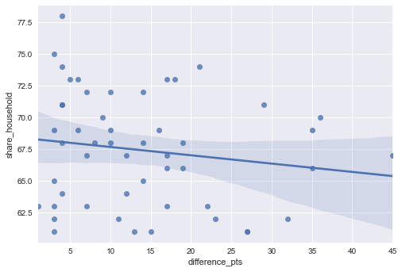
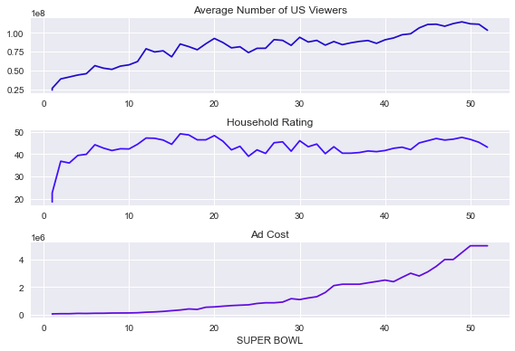

```python
import pandas as pd
import seaborn as sns
from matplotlib import pyplot as plt

#load CSV datas
super_bowls=pd.read_csv('/Users/yifeisun/Desktop/datasets/super_bowls.csv')
tv=pd.read_csv('/Users/yifeisun/Desktop/datasets/tv.csv')
halftime_musicians=pd.read_csv('/Users/yifeisun/Desktop/datasets/halftime_musicians.csv')

#show all of them with first few lines
display(super_bowls.head())
display(tv.head())
display(halftime_musicians.head())
```


<div>
<style scoped>
    .dataframe tbody tr th:only-of-type {
        vertical-align: middle;
    }

    .dataframe tbody tr th {
        vertical-align: top;
    }

    .dataframe thead th {
        text-align: right;
    }
</style>
<table border="1" class="dataframe">
  <thead>
    <tr style="text-align: right;">
      <th></th>
      <th>date</th>
      <th>super_bowl</th>
      <th>venue</th>
      <th>city</th>
      <th>state</th>
      <th>attendance</th>
      <th>team_winner</th>
      <th>winning_pts</th>
      <th>qb_winner_1</th>
      <th>qb_winner_2</th>
      <th>coach_winner</th>
      <th>team_loser</th>
      <th>losing_pts</th>
      <th>qb_loser_1</th>
      <th>qb_loser_2</th>
      <th>coach_loser</th>
      <th>combined_pts</th>
      <th>difference_pts</th>
    </tr>
  </thead>
  <tbody>
    <tr>
      <th>0</th>
      <td>2018-02-04</td>
      <td>52</td>
      <td>U.S. Bank Stadium</td>
      <td>Minneapolis</td>
      <td>Minnesota</td>
      <td>67612</td>
      <td>Philadelphia Eagles</td>
      <td>41</td>
      <td>Nick Foles</td>
      <td>NaN</td>
      <td>Doug Pederson</td>
      <td>New England Patriots</td>
      <td>33</td>
      <td>Tom Brady</td>
      <td>NaN</td>
      <td>Bill Belichick</td>
      <td>74</td>
      <td>8</td>
    </tr>
    <tr>
      <th>1</th>
      <td>2017-02-05</td>
      <td>51</td>
      <td>NRG Stadium</td>
      <td>Houston</td>
      <td>Texas</td>
      <td>70807</td>
      <td>New England Patriots</td>
      <td>34</td>
      <td>Tom Brady</td>
      <td>NaN</td>
      <td>Bill Belichick</td>
      <td>Atlanta Falcons</td>
      <td>28</td>
      <td>Matt Ryan</td>
      <td>NaN</td>
      <td>Dan Quinn</td>
      <td>62</td>
      <td>6</td>
    </tr>
    <tr>
      <th>2</th>
      <td>2016-02-07</td>
      <td>50</td>
      <td>Levi's Stadium</td>
      <td>Santa Clara</td>
      <td>California</td>
      <td>71088</td>
      <td>Denver Broncos</td>
      <td>24</td>
      <td>Peyton Manning</td>
      <td>NaN</td>
      <td>Gary Kubiak</td>
      <td>Carolina Panthers</td>
      <td>10</td>
      <td>Cam Newton</td>
      <td>NaN</td>
      <td>Ron Rivera</td>
      <td>34</td>
      <td>14</td>
    </tr>
    <tr>
      <th>3</th>
      <td>2015-02-01</td>
      <td>49</td>
      <td>University of Phoenix Stadium</td>
      <td>Glendale</td>
      <td>Arizona</td>
      <td>70288</td>
      <td>New England Patriots</td>
      <td>28</td>
      <td>Tom Brady</td>
      <td>NaN</td>
      <td>Bill Belichick</td>
      <td>Seattle Seahawks</td>
      <td>24</td>
      <td>Russell Wilson</td>
      <td>NaN</td>
      <td>Pete Carroll</td>
      <td>52</td>
      <td>4</td>
    </tr>
    <tr>
      <th>4</th>
      <td>2014-02-02</td>
      <td>48</td>
      <td>MetLife Stadium</td>
      <td>East Rutherford</td>
      <td>New Jersey</td>
      <td>82529</td>
      <td>Seattle Seahawks</td>
      <td>43</td>
      <td>Russell Wilson</td>
      <td>NaN</td>
      <td>Pete Carroll</td>
      <td>Denver Broncos</td>
      <td>8</td>
      <td>Peyton Manning</td>
      <td>NaN</td>
      <td>John Fox</td>
      <td>51</td>
      <td>35</td>
    </tr>
  </tbody>
</table>
</div>


<div>
<style scoped>
    .dataframe tbody tr th:only-of-type {
        vertical-align: middle;
    }

    .dataframe tbody tr th {
        vertical-align: top;
    }

    .dataframe thead th {
        text-align: right;
    }
</style>
<table border="1" class="dataframe">
  <thead>
    <tr style="text-align: right;">
      <th></th>
      <th>super_bowl</th>
      <th>network</th>
      <th>avg_us_viewers</th>
      <th>total_us_viewers</th>
      <th>rating_household</th>
      <th>share_household</th>
      <th>rating_18_49</th>
      <th>share_18_49</th>
      <th>ad_cost</th>
    </tr>
  </thead>
  <tbody>
    <tr>
      <th>0</th>
      <td>52</td>
      <td>NBC</td>
      <td>103390000</td>
      <td>NaN</td>
      <td>43.1</td>
      <td>68</td>
      <td>33.4</td>
      <td>78.0</td>
      <td>5000000</td>
    </tr>
    <tr>
      <th>1</th>
      <td>51</td>
      <td>Fox</td>
      <td>111319000</td>
      <td>172000000.0</td>
      <td>45.3</td>
      <td>73</td>
      <td>37.1</td>
      <td>79.0</td>
      <td>5000000</td>
    </tr>
    <tr>
      <th>2</th>
      <td>50</td>
      <td>CBS</td>
      <td>111864000</td>
      <td>167000000.0</td>
      <td>46.6</td>
      <td>72</td>
      <td>37.7</td>
      <td>79.0</td>
      <td>5000000</td>
    </tr>
    <tr>
      <th>3</th>
      <td>49</td>
      <td>NBC</td>
      <td>114442000</td>
      <td>168000000.0</td>
      <td>47.5</td>
      <td>71</td>
      <td>39.1</td>
      <td>79.0</td>
      <td>4500000</td>
    </tr>
    <tr>
      <th>4</th>
      <td>48</td>
      <td>Fox</td>
      <td>112191000</td>
      <td>167000000.0</td>
      <td>46.7</td>
      <td>69</td>
      <td>39.3</td>
      <td>77.0</td>
      <td>4000000</td>
    </tr>
  </tbody>
</table>
</div>


<div>
<style scoped>
    .dataframe tbody tr th:only-of-type {
        vertical-align: middle;
    }

    .dataframe tbody tr th {
        vertical-align: top;
    }

    .dataframe thead th {
        text-align: right;
    }
</style>
<table border="1" class="dataframe">
  <thead>
    <tr style="text-align: right;">
      <th></th>
      <th>super_bowl</th>
      <th>musician</th>
      <th>num_songs</th>
    </tr>
  </thead>
  <tbody>
    <tr>
      <th>0</th>
      <td>52</td>
      <td>Justin Timberlake</td>
      <td>11.0</td>
    </tr>
    <tr>
      <th>1</th>
      <td>52</td>
      <td>University of Minnesota Marching Band</td>
      <td>1.0</td>
    </tr>
    <tr>
      <th>2</th>
      <td>51</td>
      <td>Lady Gaga</td>
      <td>7.0</td>
    </tr>
    <tr>
      <th>3</th>
      <td>50</td>
      <td>Coldplay</td>
      <td>6.0</td>
    </tr>
    <tr>
      <th>4</th>
      <td>50</td>
      <td>Beyoncé</td>
      <td>3.0</td>
    </tr>
  </tbody>
</table>
</div>


```python
#summary of the TV data to inspect
tv.info()
print('\n')
super_bowls.info()
print('\n')
halftime_musicians.info()
```

    <class 'pandas.core.frame.DataFrame'>
    RangeIndex: 53 entries, 0 to 52
    Data columns (total 9 columns):
     #   Column            Non-Null Count  Dtype  
    ---  ------            --------------  -----  
     0   super_bowl        53 non-null     int64  
     1   network           53 non-null     object 
     2   avg_us_viewers    53 non-null     int64  
     3   total_us_viewers  15 non-null     float64
     4   rating_household  53 non-null     float64
     5   share_household   53 non-null     int64  
     6   rating_18_49      15 non-null     float64
     7   share_18_49       6 non-null      float64
     8   ad_cost           53 non-null     int64  
    dtypes: float64(4), int64(4), object(1)
    memory usage: 3.9+ KB
    
    
    <class 'pandas.core.frame.DataFrame'>
    RangeIndex: 52 entries, 0 to 51
    Data columns (total 18 columns):
     #   Column          Non-Null Count  Dtype 
    ---  ------          --------------  ----- 
     0   date            52 non-null     object
     1   super_bowl      52 non-null     int64 
     2   venue           52 non-null     object
     3   city            52 non-null     object
     4   state           52 non-null     object
     5   attendance      52 non-null     int64 
     6   team_winner     52 non-null     object
     7   winning_pts     52 non-null     int64 
     8   qb_winner_1     52 non-null     object
     9   qb_winner_2     2 non-null      object
     10  coach_winner    52 non-null     object
     11  team_loser      52 non-null     object
     12  losing_pts      52 non-null     int64 
     13  qb_loser_1      52 non-null     object
     14  qb_loser_2      3 non-null      object
     15  coach_loser     52 non-null     object
     16  combined_pts    52 non-null     int64 
     17  difference_pts  52 non-null     int64 
    dtypes: int64(6), object(12)
    memory usage: 7.4+ KB
    
    
    <class 'pandas.core.frame.DataFrame'>
    RangeIndex: 134 entries, 0 to 133
    Data columns (total 3 columns):
     #   Column      Non-Null Count  Dtype  
    ---  ------      --------------  -----  
     0   super_bowl  134 non-null    int64  
     1   musician    134 non-null    object 
     2   num_songs   88 non-null     float64
    dtypes: float64(1), int64(1), object(1)
    memory usage: 3.3+ KB


```python
%matplotlib inline
plt.style.use('seaborn')

plt.hist(super_bowls.combined_pts)
plt.xlabel('Combined Points')
plt.ylabel('Number of Super Bowls')
plt.show()

display(super_bowls[super_bowls['combined_pts']>70])
display(super_bowls[super_bowls['combined_pts']<25])
```


    

    


<div>
<style scoped>
    .dataframe tbody tr th:only-of-type {
        vertical-align: middle;
    }

    .dataframe tbody tr th {
        vertical-align: top;
    }

    .dataframe thead th {
        text-align: right;
    }
</style>
<table border="1" class="dataframe">
  <thead>
    <tr style="text-align: right;">
      <th></th>
      <th>date</th>
      <th>super_bowl</th>
      <th>venue</th>
      <th>city</th>
      <th>state</th>
      <th>attendance</th>
      <th>team_winner</th>
      <th>winning_pts</th>
      <th>qb_winner_1</th>
      <th>qb_winner_2</th>
      <th>coach_winner</th>
      <th>team_loser</th>
      <th>losing_pts</th>
      <th>qb_loser_1</th>
      <th>qb_loser_2</th>
      <th>coach_loser</th>
      <th>combined_pts</th>
      <th>difference_pts</th>
    </tr>
  </thead>
  <tbody>
    <tr>
      <th>0</th>
      <td>2018-02-04</td>
      <td>52</td>
      <td>U.S. Bank Stadium</td>
      <td>Minneapolis</td>
      <td>Minnesota</td>
      <td>67612</td>
      <td>Philadelphia Eagles</td>
      <td>41</td>
      <td>Nick Foles</td>
      <td>NaN</td>
      <td>Doug Pederson</td>
      <td>New England Patriots</td>
      <td>33</td>
      <td>Tom Brady</td>
      <td>NaN</td>
      <td>Bill Belichick</td>
      <td>74</td>
      <td>8</td>
    </tr>
    <tr>
      <th>23</th>
      <td>1995-01-29</td>
      <td>29</td>
      <td>Joe Robbie Stadium</td>
      <td>Miami Gardens</td>
      <td>Florida</td>
      <td>74107</td>
      <td>San Francisco 49ers</td>
      <td>49</td>
      <td>Steve Young</td>
      <td>NaN</td>
      <td>George Seifert</td>
      <td>San Diego Chargers</td>
      <td>26</td>
      <td>Stan Humphreys</td>
      <td>NaN</td>
      <td>Bobby Ross</td>
      <td>75</td>
      <td>23</td>
    </tr>
  </tbody>
</table>
</div>


<div>
<style scoped>
    .dataframe tbody tr th:only-of-type {
        vertical-align: middle;
    }

    .dataframe tbody tr th {
        vertical-align: top;
    }

    .dataframe thead th {
        text-align: right;
    }
</style>
<table border="1" class="dataframe">
  <thead>
    <tr style="text-align: right;">
      <th></th>
      <th>date</th>
      <th>super_bowl</th>
      <th>venue</th>
      <th>city</th>
      <th>state</th>
      <th>attendance</th>
      <th>team_winner</th>
      <th>winning_pts</th>
      <th>qb_winner_1</th>
      <th>qb_winner_2</th>
      <th>coach_winner</th>
      <th>team_loser</th>
      <th>losing_pts</th>
      <th>qb_loser_1</th>
      <th>qb_loser_2</th>
      <th>coach_loser</th>
      <th>combined_pts</th>
      <th>difference_pts</th>
    </tr>
  </thead>
  <tbody>
    <tr>
      <th>43</th>
      <td>1975-01-12</td>
      <td>9</td>
      <td>Tulane Stadium</td>
      <td>New Orleans</td>
      <td>Louisiana</td>
      <td>80997</td>
      <td>Pittsburgh Steelers</td>
      <td>16</td>
      <td>Terry Bradshaw</td>
      <td>NaN</td>
      <td>Chuck Noll</td>
      <td>Minnesota Vikings</td>
      <td>6</td>
      <td>Fran Tarkenton</td>
      <td>NaN</td>
      <td>Bud Grant</td>
      <td>22</td>
      <td>10</td>
    </tr>
    <tr>
      <th>45</th>
      <td>1973-01-14</td>
      <td>7</td>
      <td>Memorial Coliseum</td>
      <td>Los Angeles</td>
      <td>California</td>
      <td>90182</td>
      <td>Miami Dolphins</td>
      <td>14</td>
      <td>Bob Griese</td>
      <td>NaN</td>
      <td>Don Shula</td>
      <td>Washington Redskins</td>
      <td>7</td>
      <td>Bill Kilmer</td>
      <td>NaN</td>
      <td>George Allen</td>
      <td>21</td>
      <td>7</td>
    </tr>
    <tr>
      <th>49</th>
      <td>1969-01-12</td>
      <td>3</td>
      <td>Orange Bowl</td>
      <td>Miami</td>
      <td>Florida</td>
      <td>75389</td>
      <td>New York Jets</td>
      <td>16</td>
      <td>Joe Namath</td>
      <td>NaN</td>
      <td>Weeb Ewbank</td>
      <td>Baltimore Colts</td>
      <td>7</td>
      <td>Earl Morrall</td>
      <td>Johnny Unitas</td>
      <td>Don Shula</td>
      <td>23</td>
      <td>9</td>
    </tr>
  </tbody>
</table>
</div>


```python
plt.hist(super_bowls.difference_pts)
plt.xlabel('Point Difference')
plt.ylabel('Number of Super Bowls')
plt.show()

display(super_bowls[super_bowls['difference_pts']==1])
display(super_bowls[super_bowls['difference_pts']>=35])
```


    

    


<div>
<style scoped>
    .dataframe tbody tr th:only-of-type {
        vertical-align: middle;
    }

    .dataframe tbody tr th {
        vertical-align: top;
    }

    .dataframe thead th {
        text-align: right;
    }
</style>
<table border="1" class="dataframe">
  <thead>
    <tr style="text-align: right;">
      <th></th>
      <th>date</th>
      <th>super_bowl</th>
      <th>venue</th>
      <th>city</th>
      <th>state</th>
      <th>attendance</th>
      <th>team_winner</th>
      <th>winning_pts</th>
      <th>qb_winner_1</th>
      <th>qb_winner_2</th>
      <th>coach_winner</th>
      <th>team_loser</th>
      <th>losing_pts</th>
      <th>qb_loser_1</th>
      <th>qb_loser_2</th>
      <th>coach_loser</th>
      <th>combined_pts</th>
      <th>difference_pts</th>
    </tr>
  </thead>
  <tbody>
    <tr>
      <th>27</th>
      <td>1991-01-27</td>
      <td>25</td>
      <td>Tampa Stadium</td>
      <td>Tampa</td>
      <td>Florida</td>
      <td>73813</td>
      <td>New York Giants</td>
      <td>20</td>
      <td>Jeff Hostetler</td>
      <td>NaN</td>
      <td>Bill Parcells</td>
      <td>Buffalo Bills</td>
      <td>19</td>
      <td>Jim Kelly</td>
      <td>NaN</td>
      <td>Marv Levy</td>
      <td>39</td>
      <td>1</td>
    </tr>
  </tbody>
</table>
</div>


<div>
<style scoped>
    .dataframe tbody tr th:only-of-type {
        vertical-align: middle;
    }

    .dataframe tbody tr th {
        vertical-align: top;
    }

    .dataframe thead th {
        text-align: right;
    }
</style>
<table border="1" class="dataframe">
  <thead>
    <tr style="text-align: right;">
      <th></th>
      <th>date</th>
      <th>super_bowl</th>
      <th>venue</th>
      <th>city</th>
      <th>state</th>
      <th>attendance</th>
      <th>team_winner</th>
      <th>winning_pts</th>
      <th>qb_winner_1</th>
      <th>qb_winner_2</th>
      <th>coach_winner</th>
      <th>team_loser</th>
      <th>losing_pts</th>
      <th>qb_loser_1</th>
      <th>qb_loser_2</th>
      <th>coach_loser</th>
      <th>combined_pts</th>
      <th>difference_pts</th>
    </tr>
  </thead>
  <tbody>
    <tr>
      <th>4</th>
      <td>2014-02-02</td>
      <td>48</td>
      <td>MetLife Stadium</td>
      <td>East Rutherford</td>
      <td>New Jersey</td>
      <td>82529</td>
      <td>Seattle Seahawks</td>
      <td>43</td>
      <td>Russell Wilson</td>
      <td>NaN</td>
      <td>Pete Carroll</td>
      <td>Denver Broncos</td>
      <td>8</td>
      <td>Peyton Manning</td>
      <td>NaN</td>
      <td>John Fox</td>
      <td>51</td>
      <td>35</td>
    </tr>
    <tr>
      <th>25</th>
      <td>1993-01-31</td>
      <td>27</td>
      <td>Rose Bowl</td>
      <td>Pasadena</td>
      <td>California</td>
      <td>98374</td>
      <td>Dallas Cowboys</td>
      <td>52</td>
      <td>Troy Aikman</td>
      <td>NaN</td>
      <td>Jimmy Johnson</td>
      <td>Buffalo Bills</td>
      <td>17</td>
      <td>Jim Kelly</td>
      <td>Frank Reich</td>
      <td>Marv Levy</td>
      <td>69</td>
      <td>35</td>
    </tr>
    <tr>
      <th>28</th>
      <td>1990-01-28</td>
      <td>24</td>
      <td>Louisiana Superdome</td>
      <td>New Orleans</td>
      <td>Louisiana</td>
      <td>72919</td>
      <td>San Francisco 49ers</td>
      <td>55</td>
      <td>Joe Montana</td>
      <td>NaN</td>
      <td>George Seifert</td>
      <td>Denver Broncos</td>
      <td>10</td>
      <td>John Elway</td>
      <td>NaN</td>
      <td>Dan Reeves</td>
      <td>65</td>
      <td>45</td>
    </tr>
    <tr>
      <th>32</th>
      <td>1986-01-26</td>
      <td>20</td>
      <td>Louisiana Superdome</td>
      <td>New Orleans</td>
      <td>Louisiana</td>
      <td>73818</td>
      <td>Chicago Bears</td>
      <td>46</td>
      <td>Jim McMahon</td>
      <td>NaN</td>
      <td>Mike Ditka</td>
      <td>New England Patriots</td>
      <td>10</td>
      <td>Tony Eason</td>
      <td>Steve Grogan</td>
      <td>Raymond Berry</td>
      <td>56</td>
      <td>36</td>
    </tr>
  </tbody>
</table>
</div>


```python
games_tv=pd.merge(tv[tv['super_bowl']>1],super_bowls,on='super_bowl')
sns.regplot(x='difference_pts',y='share_household',data=games_tv)
```


    <AxesSubplot:xlabel='difference_pts', ylabel='share_household'>


    

    


```python
plt.subplot(3,1,1)
plt.plot(tv.super_bowl,tv.avg_us_viewers,color='#200CCC')
plt.title('Average Number of US Viewers')
plt.subplot(3,1,2)
plt.plot(tv.super_bowl,tv.rating_household,color='#400EFF')
plt.title('Household Rating')
plt.subplot(3,1,3)
plt.plot(tv.super_bowl,tv.ad_cost,color='#600CDF')
plt.title('Ad Cost')
plt.xlabel('SUPER BOWL')

plt.tight_layout()
```


    

    


```python
#display all halftime musicians for super_bowl
halftime_musicians[halftime_musicians.super_bowl<=27]
```


<div>
<style scoped>
    .dataframe tbody tr th:only-of-type {
        vertical-align: middle;
    }

    .dataframe tbody tr th {
        vertical-align: top;
    }

    .dataframe thead th {
        text-align: right;
    }
</style>
<table border="1" class="dataframe">
  <thead>
    <tr style="text-align: right;">
      <th></th>
      <th>super_bowl</th>
      <th>musician</th>
      <th>num_songs</th>
    </tr>
  </thead>
  <tbody>
    <tr>
      <th>80</th>
      <td>27</td>
      <td>Michael Jackson</td>
      <td>5.0</td>
    </tr>
    <tr>
      <th>81</th>
      <td>26</td>
      <td>Gloria Estefan</td>
      <td>2.0</td>
    </tr>
    <tr>
      <th>82</th>
      <td>26</td>
      <td>University of Minnesota Marching Band</td>
      <td>NaN</td>
    </tr>
    <tr>
      <th>83</th>
      <td>25</td>
      <td>New Kids on the Block</td>
      <td>2.0</td>
    </tr>
    <tr>
      <th>84</th>
      <td>24</td>
      <td>Pete Fountain</td>
      <td>1.0</td>
    </tr>
    <tr>
      <th>85</th>
      <td>24</td>
      <td>Doug Kershaw</td>
      <td>1.0</td>
    </tr>
    <tr>
      <th>86</th>
      <td>24</td>
      <td>Irma Thomas</td>
      <td>1.0</td>
    </tr>
    <tr>
      <th>87</th>
      <td>24</td>
      <td>Pride of Nicholls Marching Band</td>
      <td>NaN</td>
    </tr>
    <tr>
      <th>88</th>
      <td>24</td>
      <td>The Human Jukebox</td>
      <td>NaN</td>
    </tr>
    <tr>
      <th>89</th>
      <td>24</td>
      <td>Pride of Acadiana</td>
      <td>NaN</td>
    </tr>
    <tr>
      <th>90</th>
      <td>23</td>
      <td>Elvis Presto</td>
      <td>7.0</td>
    </tr>
    <tr>
      <th>91</th>
      <td>22</td>
      <td>Chubby Checker</td>
      <td>2.0</td>
    </tr>
    <tr>
      <th>92</th>
      <td>22</td>
      <td>San Diego State University Marching Aztecs</td>
      <td>NaN</td>
    </tr>
    <tr>
      <th>93</th>
      <td>22</td>
      <td>Spirit of Troy</td>
      <td>NaN</td>
    </tr>
    <tr>
      <th>94</th>
      <td>21</td>
      <td>Grambling State University Tiger Marching Band</td>
      <td>8.0</td>
    </tr>
    <tr>
      <th>95</th>
      <td>21</td>
      <td>Spirit of Troy</td>
      <td>8.0</td>
    </tr>
    <tr>
      <th>96</th>
      <td>20</td>
      <td>Up with People</td>
      <td>NaN</td>
    </tr>
    <tr>
      <th>97</th>
      <td>19</td>
      <td>Tops In Blue</td>
      <td>NaN</td>
    </tr>
    <tr>
      <th>98</th>
      <td>18</td>
      <td>The University of Florida Fightin' Gator March...</td>
      <td>7.0</td>
    </tr>
    <tr>
      <th>99</th>
      <td>18</td>
      <td>The Florida State University Marching Chiefs</td>
      <td>7.0</td>
    </tr>
    <tr>
      <th>100</th>
      <td>17</td>
      <td>Los Angeles Unified School District All City H...</td>
      <td>NaN</td>
    </tr>
    <tr>
      <th>101</th>
      <td>16</td>
      <td>Up with People</td>
      <td>NaN</td>
    </tr>
    <tr>
      <th>102</th>
      <td>15</td>
      <td>The Human Jukebox</td>
      <td>NaN</td>
    </tr>
    <tr>
      <th>103</th>
      <td>15</td>
      <td>Helen O'Connell</td>
      <td>NaN</td>
    </tr>
    <tr>
      <th>104</th>
      <td>14</td>
      <td>Up with People</td>
      <td>NaN</td>
    </tr>
    <tr>
      <th>105</th>
      <td>14</td>
      <td>Grambling State University Tiger Marching Band</td>
      <td>NaN</td>
    </tr>
    <tr>
      <th>106</th>
      <td>13</td>
      <td>Ken Hamilton</td>
      <td>NaN</td>
    </tr>
    <tr>
      <th>107</th>
      <td>13</td>
      <td>Gramacks</td>
      <td>NaN</td>
    </tr>
    <tr>
      <th>108</th>
      <td>12</td>
      <td>Tyler Junior College Apache Band</td>
      <td>NaN</td>
    </tr>
    <tr>
      <th>109</th>
      <td>12</td>
      <td>Pete Fountain</td>
      <td>NaN</td>
    </tr>
    <tr>
      <th>110</th>
      <td>12</td>
      <td>Al Hirt</td>
      <td>NaN</td>
    </tr>
    <tr>
      <th>111</th>
      <td>11</td>
      <td>Los Angeles Unified School District All City H...</td>
      <td>NaN</td>
    </tr>
    <tr>
      <th>112</th>
      <td>10</td>
      <td>Up with People</td>
      <td>NaN</td>
    </tr>
    <tr>
      <th>113</th>
      <td>9</td>
      <td>Mercer Ellington</td>
      <td>NaN</td>
    </tr>
    <tr>
      <th>114</th>
      <td>9</td>
      <td>Grambling State University Tiger Marching Band</td>
      <td>NaN</td>
    </tr>
    <tr>
      <th>115</th>
      <td>8</td>
      <td>University of Texas Longhorn Band</td>
      <td>NaN</td>
    </tr>
    <tr>
      <th>116</th>
      <td>8</td>
      <td>Judy Mallett</td>
      <td>NaN</td>
    </tr>
    <tr>
      <th>117</th>
      <td>7</td>
      <td>University of Michigan Marching Band</td>
      <td>NaN</td>
    </tr>
    <tr>
      <th>118</th>
      <td>7</td>
      <td>Woody Herman</td>
      <td>NaN</td>
    </tr>
    <tr>
      <th>119</th>
      <td>7</td>
      <td>Andy Williams</td>
      <td>NaN</td>
    </tr>
    <tr>
      <th>120</th>
      <td>6</td>
      <td>Ella Fitzgerald</td>
      <td>NaN</td>
    </tr>
    <tr>
      <th>121</th>
      <td>6</td>
      <td>Carol Channing</td>
      <td>NaN</td>
    </tr>
    <tr>
      <th>122</th>
      <td>6</td>
      <td>Al Hirt</td>
      <td>NaN</td>
    </tr>
    <tr>
      <th>123</th>
      <td>6</td>
      <td>United States Air Force Academy Cadet Chorale</td>
      <td>NaN</td>
    </tr>
    <tr>
      <th>124</th>
      <td>5</td>
      <td>Southeast Missouri State Marching Band</td>
      <td>NaN</td>
    </tr>
    <tr>
      <th>125</th>
      <td>4</td>
      <td>Marguerite Piazza</td>
      <td>NaN</td>
    </tr>
    <tr>
      <th>126</th>
      <td>4</td>
      <td>Doc Severinsen</td>
      <td>NaN</td>
    </tr>
    <tr>
      <th>127</th>
      <td>4</td>
      <td>Al Hirt</td>
      <td>NaN</td>
    </tr>
    <tr>
      <th>128</th>
      <td>4</td>
      <td>The Human Jukebox</td>
      <td>NaN</td>
    </tr>
    <tr>
      <th>129</th>
      <td>3</td>
      <td>Florida A&amp;M University Marching 100 Band</td>
      <td>NaN</td>
    </tr>
    <tr>
      <th>130</th>
      <td>2</td>
      <td>Grambling State University Tiger Marching Band</td>
      <td>NaN</td>
    </tr>
    <tr>
      <th>131</th>
      <td>1</td>
      <td>University of Arizona Symphonic Marching Band</td>
      <td>NaN</td>
    </tr>
    <tr>
      <th>132</th>
      <td>1</td>
      <td>Grambling State University Tiger Marching Band</td>
      <td>NaN</td>
    </tr>
    <tr>
      <th>133</th>
      <td>1</td>
      <td>Al Hirt</td>
      <td>NaN</td>
    </tr>
  </tbody>
</table>
</div>


```python
#most halftime show appearance
halftime_appearances=halftime_musicians.groupby('musician').count()['super_bowl'].reset_index()
halftime_appearances=halftime_appearances.sort_values('super_bowl',ascending=False)
halftime_appearances[halftime_appearances['super_bowl']>1]
```


<div>
<style scoped>
    .dataframe tbody tr th:only-of-type {
        vertical-align: middle;
    }

    .dataframe tbody tr th {
        vertical-align: top;
    }

    .dataframe thead th {
        text-align: right;
    }
</style>
<table border="1" class="dataframe">
  <thead>
    <tr style="text-align: right;">
      <th></th>
      <th>musician</th>
      <th>super_bowl</th>
    </tr>
  </thead>
  <tbody>
    <tr>
      <th>28</th>
      <td>Grambling State University Tiger Marching Band</td>
      <td>6</td>
    </tr>
    <tr>
      <th>104</th>
      <td>Up with People</td>
      <td>4</td>
    </tr>
    <tr>
      <th>1</th>
      <td>Al Hirt</td>
      <td>4</td>
    </tr>
    <tr>
      <th>83</th>
      <td>The Human Jukebox</td>
      <td>3</td>
    </tr>
    <tr>
      <th>76</th>
      <td>Spirit of Troy</td>
      <td>2</td>
    </tr>
    <tr>
      <th>25</th>
      <td>Florida A&amp;M University Marching 100 Band</td>
      <td>2</td>
    </tr>
    <tr>
      <th>26</th>
      <td>Gloria Estefan</td>
      <td>2</td>
    </tr>
    <tr>
      <th>102</th>
      <td>University of Minnesota Marching Band</td>
      <td>2</td>
    </tr>
    <tr>
      <th>10</th>
      <td>Bruno Mars</td>
      <td>2</td>
    </tr>
    <tr>
      <th>64</th>
      <td>Pete Fountain</td>
      <td>2</td>
    </tr>
    <tr>
      <th>5</th>
      <td>Beyoncé</td>
      <td>2</td>
    </tr>
    <tr>
      <th>36</th>
      <td>Justin Timberlake</td>
      <td>2</td>
    </tr>
    <tr>
      <th>57</th>
      <td>Nelly</td>
      <td>2</td>
    </tr>
    <tr>
      <th>44</th>
      <td>Los Angeles Unified School District All City H...</td>
      <td>2</td>
    </tr>
  </tbody>
</table>
</div>


```python
#Who performed the most songs in a halftime show
no_bands=halftime_musicians[~halftime_musicians.musician.str.contains('Marching')]
no_bands=no_bands[~no_bands.musician.str.contains('Spirit')]
#make a plot
most_songs=int(max(no_bands['num_songs'].values))
plt.hist(no_bands.num_songs.dropna(),bins=5)
plt.xlabel('Number of Songs Per Halftime Show Performance')
plt.ylabel('Number of Musicians')
plt.show()

no_bands=no_bands.sort_values('num_songs',ascending=False)
display(no_bands.head(15))
```


    

    


<div>
<style scoped>
    .dataframe tbody tr th:only-of-type {
        vertical-align: middle;
    }

    .dataframe tbody tr th {
        vertical-align: top;
    }

    .dataframe thead th {
        text-align: right;
    }
</style>
<table border="1" class="dataframe">
  <thead>
    <tr style="text-align: right;">
      <th></th>
      <th>super_bowl</th>
      <th>musician</th>
      <th>num_songs</th>
    </tr>
  </thead>
  <tbody>
    <tr>
      <th>0</th>
      <td>52</td>
      <td>Justin Timberlake</td>
      <td>11.0</td>
    </tr>
    <tr>
      <th>70</th>
      <td>30</td>
      <td>Diana Ross</td>
      <td>10.0</td>
    </tr>
    <tr>
      <th>10</th>
      <td>49</td>
      <td>Katy Perry</td>
      <td>8.0</td>
    </tr>
    <tr>
      <th>2</th>
      <td>51</td>
      <td>Lady Gaga</td>
      <td>7.0</td>
    </tr>
    <tr>
      <th>90</th>
      <td>23</td>
      <td>Elvis Presto</td>
      <td>7.0</td>
    </tr>
    <tr>
      <th>33</th>
      <td>41</td>
      <td>Prince</td>
      <td>7.0</td>
    </tr>
    <tr>
      <th>16</th>
      <td>47</td>
      <td>Beyoncé</td>
      <td>7.0</td>
    </tr>
    <tr>
      <th>14</th>
      <td>48</td>
      <td>Bruno Mars</td>
      <td>6.0</td>
    </tr>
    <tr>
      <th>3</th>
      <td>50</td>
      <td>Coldplay</td>
      <td>6.0</td>
    </tr>
    <tr>
      <th>25</th>
      <td>45</td>
      <td>The Black Eyed Peas</td>
      <td>6.0</td>
    </tr>
    <tr>
      <th>20</th>
      <td>46</td>
      <td>Madonna</td>
      <td>5.0</td>
    </tr>
    <tr>
      <th>30</th>
      <td>44</td>
      <td>The Who</td>
      <td>5.0</td>
    </tr>
    <tr>
      <th>80</th>
      <td>27</td>
      <td>Michael Jackson</td>
      <td>5.0</td>
    </tr>
    <tr>
      <th>64</th>
      <td>32</td>
      <td>The Temptations</td>
      <td>4.0</td>
    </tr>
    <tr>
      <th>36</th>
      <td>39</td>
      <td>Paul McCartney</td>
      <td>4.0</td>
    </tr>
  </tbody>
</table>
</div>


```python
#Conclusion
patriots='New England Patriots'
rams='Los Angeles Rams'
super_bowl_LIII_winner=rams
print('The winner of Super Bowl LIII will be the',super_bowl_LIII_winner)

```

    The winner of Super Bowl LIII will be the Los Angeles Rams


```python

```
